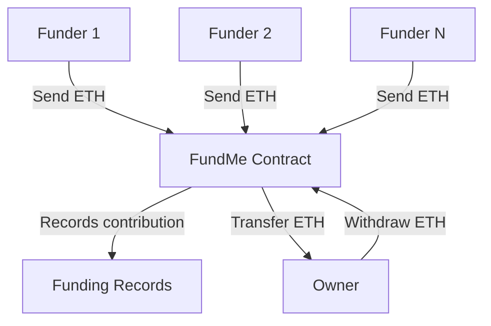

# FundMe — Foundry Project

A decentralized crowdfunding smart contract built with **Solidity** and **Foundry**, inspired by Patrick Collins' Web3 course.  
This project demonstrates **unit testing**, **integration testing**, and **deployment scripting** using Foundry's development framework.

---

## 📜 Overview

`FundMe` is a smart contract that allows anyone to:
- Fund the contract with ETH
- Keep track of who funded and how much
- Allow the contract owner to withdraw the funds

It uses a **Chainlink Price Feed** to enforce a minimum funding amount in USD equivalent.

---

## 🔄 Funding & Withdrawal Flow



---

## 🛠 Tech Stack

* **Language:** Solidity `^0.8.0`
* **Framework:** [Foundry](https://getfoundry.sh/)
* **Libraries:**

  * `forge-std` — Foundry standard library for testing
  * `foundry-devops` — helper scripts for contract interaction
* **Oracles:** Chainlink Price Feeds (for ETH/USD conversion)

---

## 📂 Project Structure

```
.
├── script/
│   ├── DeployFundMe.s.sol         # Deployment script
│   ├── HelperConfig.s.sol         # Chainlink feed configuration
│   └── IndividualFuncScript.s.sol # Script for testing individual functions
│
├── src/
│   └── FundMe.sol                  # Main smart contract
│
├── test/
│   ├── integration/
│   │   └── FundMeIntegrate.t.sol   # Integration tests (live networks)
│   │
│   ├── mock/
│   │   └── MockV3Aggregator.sol    # Mock price feed for local tests
│   │
│   └── unit/
│       └── FundMeUnit.t.sol        # Unit tests (with mocks)
│
└── foundry.toml                     # Foundry configuration
```

---

## ⚙️ Installation

1. **Clone the repository**

   ```bash
   git clone <your-repo-url>
   cd fundme-foundry
   ```

2. **Install Foundry** (if not already installed)

   ```bash
   curl -L https://foundry.paradigm.xyz | bash
   foundryup
   ```

3. **Install dependencies**

   ```bash
   forge install
   ```

4. **Create `.env` file**

   ```env
    ANVIL_PRIVATE_KEY="private-key-anvil"
    ZKSYNC_PRIVATE_KEY="private-key-zksync"
    SEPOLIA_RPC_URL="sepolia-rpc-with-your-api"
    ZKSYNC_SEPOLIA_RPC="zksync-sepolia-rpc"
    ANVIL_ZKSYNC_RPC=http://localhost:8011
    ANVIL_RPC=http://localhost:8545
    SEPOLIA_ETH_TO_USD_PROXY="proxy-rpc-rul"
    ETHERSCAN_API_KEY="your-etherscan-api-key"
   ```

---

## 🧪 Running Tests

**If using forge on CLI, run first:**
```bash
source .env
```

### Unit Tests (local mock price feed)

```bash
forge test
```
or use **make**
```bash
make test-anvil
```

### Integration Tests (live network)

```bash
forge test --fork-url $SEPOLIA_RPC_URL
```
or use **make**
```bash
make test-sepolia
```

---

## 🚀 Deployment

### Deploy to Local Anvil

```bash
anvil
forge script script/DeployFundMe.s.sol --rpc-url http://127.0.0.1:8545 --private-key $PRIVATE_KEY --broadcast
```
or use **make**
```bash
make deploy-anvil
```

### Deploy to Sepolia Testnet

using **make**
```bash
make deploy-sepolia
```
#### With Verification and Broadcast

using **make**
```bash
make deploy-sepolia BROADCAST=1 VERIFY=1
```
using **forge**
```bash
forge script script/DeployFundMe.s.sol --account testnet_account --broadcast --rpc-url $SEPOLIA_RPC_URL --verify --etherscan-api-key $ETHERSCAN_API_KEY
```


---

## 📌 Key Features

* Minimum funding requirement in USD
* Tracks all funders & amounts
* Owner-only withdrawal
* Fully tested with mocks & integration tests
* Deployable to multiple networks

---

## 📜 License

This project is licensed under the MIT License.